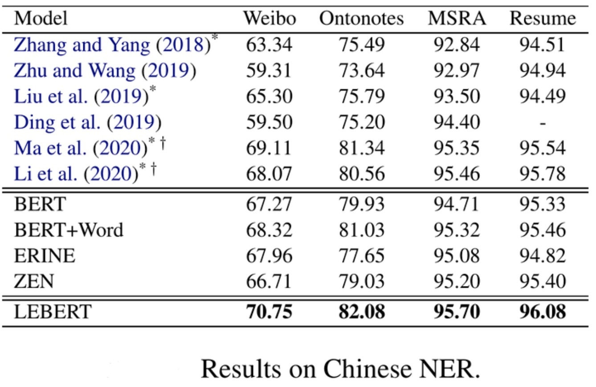
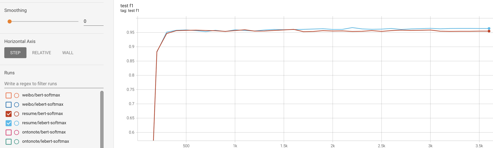
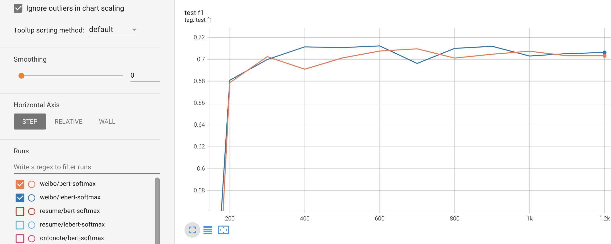
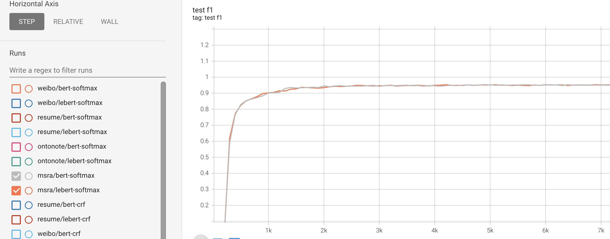
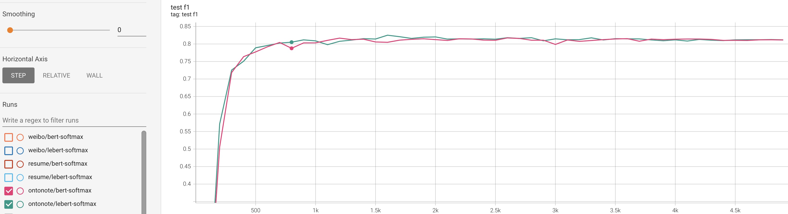

# LEBERT-基于词汇信息融合的中文命名实体识别模型

## 项目简介
微信公众号【YeungNLP】文章：[LEBERT：基于词汇增强的中文NER模型](https://mp.weixin.qq.com/s/1MxTx10_lA5iFvBqkX_Q3A)

[LEBERT](https://arxiv.org/abs/2105.07148) 是将词汇信息引入到BERT模型中的NER模型，
本项目的目的在于验证[LEBERT](https://arxiv.org/abs/2105.07148) 模型在中文NER数据集上的表现。分别验证了Bert-Softmax、Bert-Crf、
LEBert-Softmax、LEBert-Crf在Resume、Ontonote、Msra、Weibo四个中文数据集上的表现。

### 数据集
本项目将四个数据集统一处理成相同的数据格式，每一行表示一条数据。
格式如下：
```
{"text": ["赵", "伟", "先", "生", "，"], "label": ["B-NAME", "I-NAME", "O", "O", "O"]}
```

## 运行环境
python==3.6、transformers==3.1.0、torch==1.10.0

运行下面脚本安装依赖环境：
```
pip install -r requirements.txt
```


## 项目结构
- datasets：存放数据
    - resume
    - msra
    - weibo
    - ontonote4
- losses:损失函数
- metrics:计算NER的评价指标
- models:存放自己实现的BERT模型代码
    - crf.py:存放CRF模型实现
    - lebert.py:LEBER模型实现
    - ner_model.py
- output:输出目录
- pretrain_model：预训练模型存放位置
- processors:数据预处理模型
    - convert_format.py:将原始数据集，整理成统一的json格式
    - dataset.py
    - processor.py:数据处理
    - trie_tree.py：字典树实现
    - vocab.py：字典类
- script：脚本存放位置
- utils:存放工具类
- train.py:训练脚本


## 使用方法
### Quick Start
安装依赖包
```
pip install -r requirements.txt
```
运行训练脚本，详见参数说明
```
bash script/train.sh
```

## 实验总结

### 实验细节
所有模型均使用[bert-base-chines](https://huggingface.co/bert-base-chinese) 的预训练权重。在训练的时候，batch size均为32，
BERT的原始参数的学习率设置为1e-5，LEBERT和CRF所引入的参数的学习率设置为1e-4。对于Ontonote、Msra数据集训练10个epoch，
对于Resume和Weibo数据集训练30个epoch。
原论文的词向量使用的是包含两千万单词的[tencent-ailab-embedding-zh-d200-v0.2.0](https://ai.tencent.com/ailab/nlp/en/download.html) ，
本项目的词向量使用[tencent-ailab-embedding-zh-d200-v0.2.0-s](https://ai.tencent.com/ailab/nlp/en/download.html) ,其中包含两百万预训练的词向量,维度为200。
本项目将词向量信息在BERT的第一层之后进行融合，并且每个汉字，最多融合3个词向量。

### 实验结果

各模型在测试集上的指标：

|  模型 | Resume|Weibo| Msra| Ontonote|
| ----  | ----  | ----  |  ----  |  ----  |
|BERT-Sotfmax| 0.9610   | 0.7097  |0.9542|0.8173|
|LEBERT+Sotfmax| __0.9672__   | __0.7123__  |0.9536|__0.825__|
|BERT+Crf| 0.9608   | 0.7048  |0.9548|0.8191|
|LEBERT+Crf| 0.9614   | 0.6954  |__0.955__|0.817|

各模型在验证集上的指标：

|  模型 | Resume|Weibo| Msra| Ontonote|
| ----  | ----  | ----  |  ----  |  ----  |
|BERT-Sotfmax| 0.9593   | 0.6984  |0.9363|0.8031|
|LEBERT+Sotfmax| 0.9601   | 0.7147 |0.9382|0.8038|
|BERT+Crf| 0.9564   | 0.7127  |0.938|__0.8078__|
|LEBERT+Crf| __0.9638__   | __0.7247__  |__0.9391__|0.8021|

原论文实验效果：



### 训练过程分析
训练过程中，模型在验证集和测试集上的F1得分与loss的变化，可以通过output文件夹下查看，运行如下脚本：
```
tensorboard --logdir ./output 
```
训练过程中，BERT-Softmax与LEBERT-Softmax在各个测试集上的F1得分的变化曲线如下图：

Resume测试集：

Weibo测试集：

Msra测试集：

Ontonote测试集:


从上面的实验结果和训练过程分析，做一下简单的总结：
- 在四个数据集上，LEBERT均优于BERT，这得益于词汇信息的引入。
- 在四个数据集上，LEBERT-Softmax的指标只比BERT-Softmax提升0.5-1.0个点，没有带来特别大的收益（也可能是训练策略、实现细节、词向量质量的原因）。
- 本项目复现的LEBERT-Softmax模型基本都达到了原论文的水平，并且BERT-Softmax模型在各个测试集上的表现均优于原论文的结果。
- 相比于Softmax解码方式，CRF解码方式有时候会带来更差的效果（可能是因为训练策略的原因，如学习率太小，有待进一步验证）。

### 模型权重分享
|  模型 | Resume|Weibo| Msra| Ontonote|
| ----  | ----  | ----  |  ----  |  ----  |
|BERT-Sotfmax|    |   |||
|LEBERT+Sotfmax|    |   |||
|BERT+Crf|    |   |||
|LEBERT+Crf|    |   |||

## REFERENCE
- https://ai.tencent.com/ailab/nlp/en/embedding.html
- https://github.com/liuwei1206/LEBERT
- https://arxiv.org/abs/2105.07148
- https://github.com/lonePatient/BERT-NER-Pytorch


