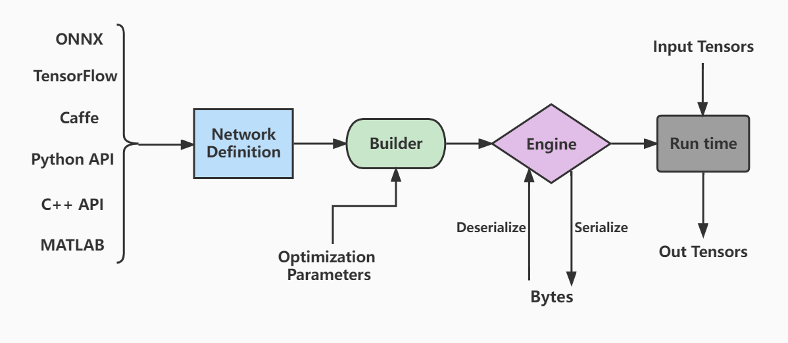
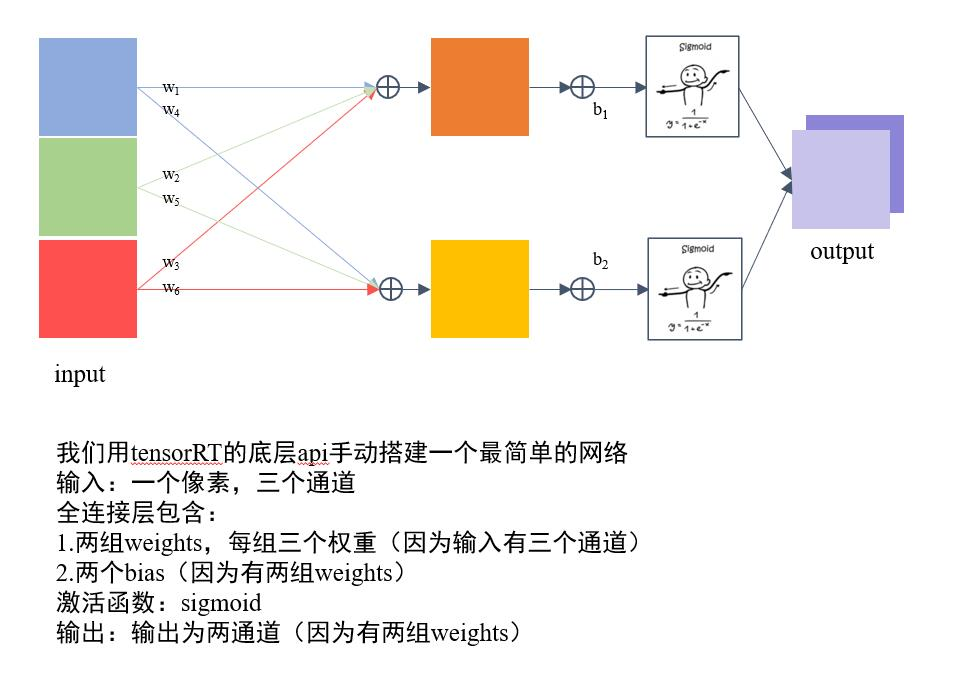

# 项目目标：了解tensorRT是怎么构建和编译一个模型的
## 运行
```
make run
```
## 知识点
- main.cpp 构建了一个最简单全连接网络
- tensorrt的工作流程如下图：
  - 首先定义网络
  - 优化builder参数
  - 通过builder生成engine,用于模型保存、推理等
  - engine可以通过序列化和逆序列化转化模型数据类型（转化为二进制byte文件，加快传输速率），再进一步推动模型由输入张量到输出张量的推理。
- code structure
   1. 定义 builder, config 和network，其中builder表示所创建的构建器，config表示创建的构建配置（指定TensorRT应该如何优化模型），network为创建的网络定义。
   2. 输入，模型结构和输出的基本信息（如下图所示）
   
   1. 生成engine模型文件
   2. 序列化模型文件并存储
- [官方文档参考部分 C++ API](https://docs.nvidia.com/deeplearning/tensorrt/developer-guide/index.html#:~:text=the%20Polygraphy%20repository.-,3.%C2%A0The%20C%2B%2B%20API,-This%20chapter%20illustrates)