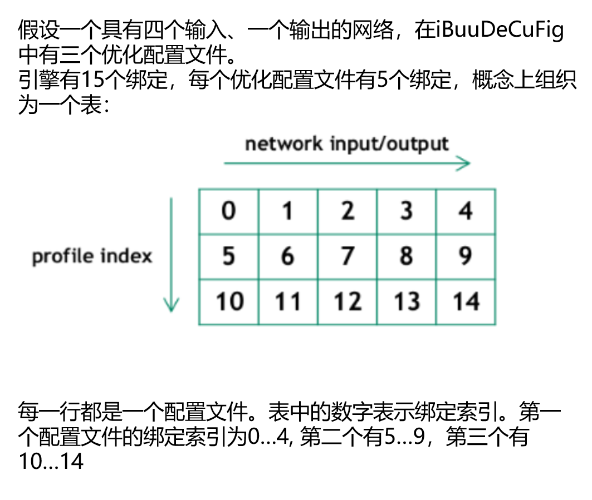

# 项目目标：用tensorRT动态shape去进行cnn推理
- 注意：1.1 和 1.2 都是全连接网络，1.3是

## 知识点
1. 构建网络时：
    - 1.1. 必须在模型定义时，输入维度给定为-1，否则该维度不会动态。注意一下两点：
        - 1.1.1. 若onnx文件，则onnx文件打开后应该看到为动态或者-1
        - 1.1.2. 如果你的模型中存在reshape类操作，那么reshape的参数必须随动态进行计算。而大部分时候这都是问题。除非你是全卷积模型，否则大部分时候只需要为batch_size维度设置为动态，其他维度尽量避免设置动态
    - 1.2. 配置profile:
       - 1.2.1. create: `builder->createOptimizationProfile()`
       - 1.2.2. set: `setDimensions()`设置`kMIN`, `kOPT`, `kMAX`的一系列输入尺寸范围
       - 1.2.3. add:`config->addOptimizationProfile(profile);`添加profile到网络配置中
2. 推理阶段时：
    - 2.1. 您需要在选择profile的索引后设置`input`维度：`execution_context->setBindingDimensions(0, nvinfer1::Dims4(1, 1, 3, 3));` 
      - 2.1.1. 关于profile索引:
        
      - 2.1.2. 在运行时，向engine请求绑定维度会返回用于构建网络的相同维度。这意味着，得到的还是动态的维度[-1, in_channel, -1, -1]：
        ```cpp
        engine.getBindingDimensions(0) // return [-1, 1, -1, -1]
        ```
        获取当前的实际维度，需要查询执行上下文：
        ```cpp
        context.getBindingDimensions(0) // return [3, 1, 3, 3]
        ```

3. 检查正确性
    - 我们通常可以利用pytorch来校验是否发生了错误


## 运行
c++ 部分
```bash
make run
```
python 部分 (用来验证c++的结果对不对)
```python
python conv-test.py
```