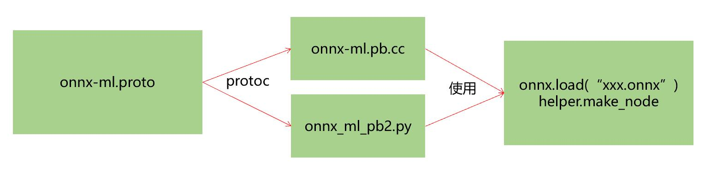
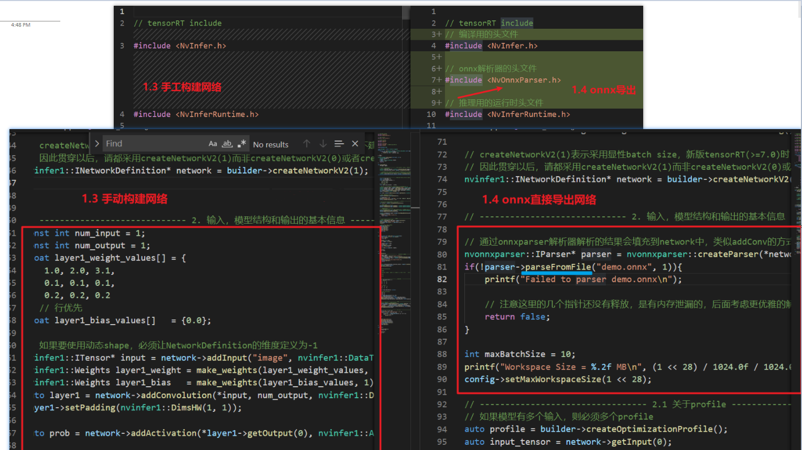
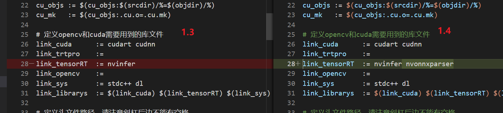

# 运行

```python
python gen-onnx.py
```

# 知识点
1. 什么是onnx:
   1. 先看名字：Open Neural Network Exchange(ONNX) 是一个开放的生态系统，使代码不被局限在框架和平台中。
   2. 具体一点：onnx可以把你的神经网络模型(PyTroch, TF, Caffe)统统转为标准的ONNX格式(一种protobuf格式)，然后就可在各种平台(云平台, windows, linux)和设备(cpu, gpu, npu)上运行
   
2. 先看文件`gen-onnx.py`以pytorch构建的模型为例讲：pytorch模型转onnx格式
   1. 构建一个pytorch网络，并声明一个model对象
   2. 如果进行推理，将模型设为推理状态：这一点很重要，因为像dropout, batchnorm这样的算子在推理和训练模式下的行为是不同的。
   3. 导出为onnx模型：`torch.onnx.export()`
   4. 运行python脚本，生成onnx，在`main.cpp`中会对其进行解析
      ```python
      python gen-onnx.py
      ```
   5. 运行后的图示：
      
      -  Protobuf则通过onnx-ml.proto编译得到onnx-ml.pb.h和onnx-ml.pb.cc或onnx_ml_pb2.py
      -  然后用onnx-ml.pb.cc和代码来操作onnx模型文件，实现增删改
      -  onnx-ml.proto则是描述onnx文件如何组成的，具有什么结构，他是操作onnx经常参照的东西
3. 再看文件`main.cpp`讲解如何解析onnx格式
   1. 使用onnx解析器：`createParser`的api在文件NvOnnxParser.h中
   2. 在这里使用onnx的结果填充到network中，而手动构建网络则是将输入和算子填入network中，区别如图所示：
      
   3. 导出后，可以使用netron软件进行打开查看:https://github.com/lutzroeder/Netron
4.  除了构建过程的区别，makefile中，库文件也需要加上nvonnxparser：
      

# 注意：
- severity_string 和 log仅是工具函数，无需过分关注