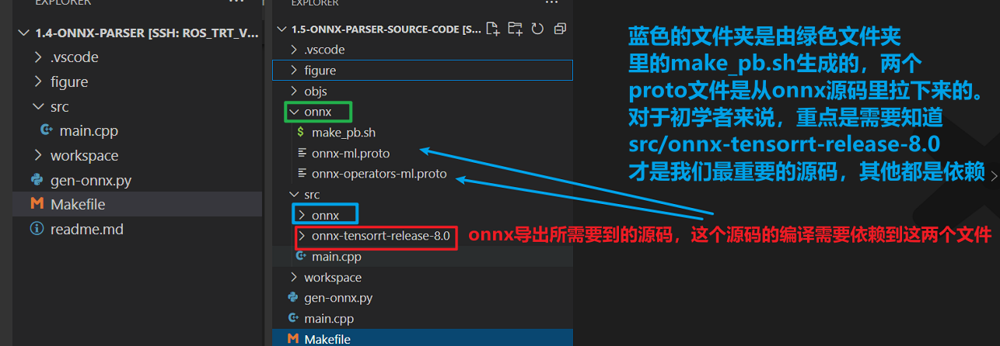
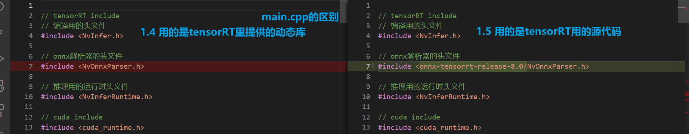

# 知识点
1. 目标：本小节学习如何从源码编译onnx解析器
   -文件结构：
   
2. nvonnxparser已经被nvidia给开源了，可以使用官方自带的解析器，也可以使用源代码进行编译
- <details> <!-- -->
     <summary> 详情 </summary>

   - 为了使用onnx导出网络有两种方式
     - 方法1： 我们使用自带的解析器，已经是动态库了, trtpy 也提供了放在特定地址下
         - 例：/datav/software/anaconda3/lib/python3.9/site-packages/trtpy/trt8cuda112cudnn8/lib64/libnvonnxparser.so
     - 方法2：要么我们直接使用源代码来编译
       - 源代码下载地址：https://github.com/onnx/onnx-tensorrt/tree/release/8.0
     - 参考figure/structure.png 有助于理解本项目与上一个项目的差异
       - [onnx-ml.proto 来源](https://github.com/onnx/onnx/blob/main/onnx/onnx-ml.proto)
       - [onnx-operators-ml.proto 来源](https://github.com/onnx/onnx/blob/main/onnx/onnx-operators-ml.proto)
       
 </details> <!-- -->

2. 如果需要在其他地方使用解析器，请把onnx下的pb文件，使用protoc进行编译后得到头文件，替换src/onnx下的文件
3. onnx本质上是一个protobuf序列化后储存的文件，因此他依赖了protobuf做反序列化解析
4. 使用源代码进行编译的好处是，可以对其进行定制化，例如插件部分的时候，或者不支持的新算子的时候
5. 1.4 与 1.5 的在`main.cpp`中的唯一区别是：
    - 1.4 指定的是自带的解析器
    - 1.5 是从源码编译解析器
      

# 执行方式
1. 生成onnx文件
      ```python
      python gen-onnx.py
      ```
     - 要求安装有pytorch
     - 产生的文件会储存在workspace下
     - 产生的demo.onnx可以使用netron进行打开查看
2. 执行编译trt模型
    ```
    make run
    ```


# 编译proto
1. `bash onnx/make_pb.sh`执行编译，它会自动复制文件到src/onnx下