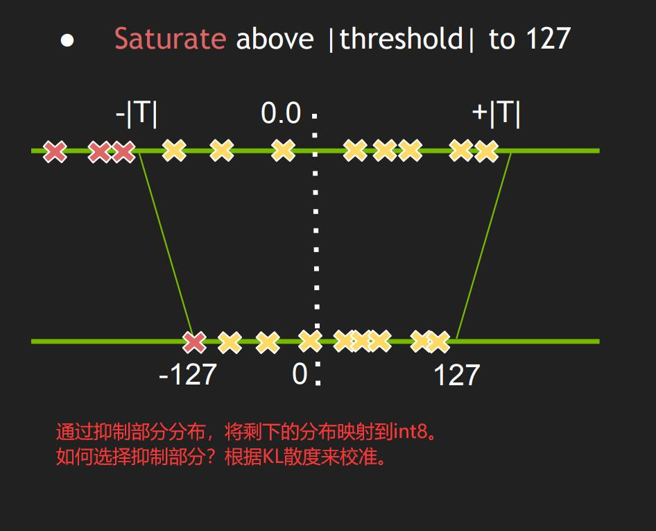
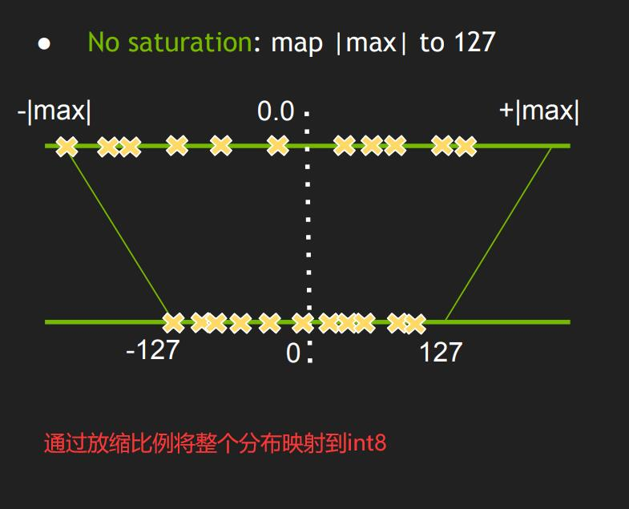

## 知识点：
1. 对于int8，需要配置setFlag nvinfer1::BuilderFlag::kINT8，并且配置setInt8Calibrator
2. 对于Int8EntropyCalibrator，则需要继承自IInt8EntropyCalibrator2
3. Int8EntropyCalibrator的作用，是读取并预处理图像数据作为输入
    - 标定的原理，是通过输入标定图像I，使用参数WInt8推理得到输出结果PInt8，然后不断调整WInt8，使得输出PInt8与PFloat32越接近越好
    - 因此标定时通常需要使用一些图像，正常发布时，一般使用100张图左右即可
4. 常用的Calibrator
   - Int8EntropyCalibrator2
        熵校准选择张量的比例因子来优化量化张量的信息论内容，通常会抑制分布中的异常值。这是当前推荐的熵校准器。默认情况下，校准发生在图层融合之前。推荐用于基于 CNN 的网络。
        
   - Iint8MinMaxCalibrator
        该校准器使用激活分布的整个范围来确定比例因子。它似乎更适合NLP任务。默认情况下，校准发生在图层融合之前。推荐用于NVIDIA BERT等网络。
        
5. 计算机中的float计算量是非常大的，而改成int8后，计算量相比可以提升数倍
    - 对于实际操作时，input[float32], w[int8], bias[float32], output[float32]
    - 步骤如下：
        - input[int8] = to_int8(input[float32])
        - y[int16] = input[int8] * w[int8]   # 此处乘法会由计算机转换为int16，保证精度
        - output[float32] = to_float32(y[int16]) + bias[float32]
    - 所以整个过程的只是为了减少float32的乘法数量以实现提速
    - 对于to_int8的过程，并不是直接的线性缩放，而是经过KL散度计算最合适的截断点（最大、最小值），进而进行缩放，使得权重的分布尽可能小的被改变
        - 可以参照这个地址：https://on-demand.gputechconf.com/gtc/2017/presentation/s7310-8-bit-inference-with-tensorrt.pdf