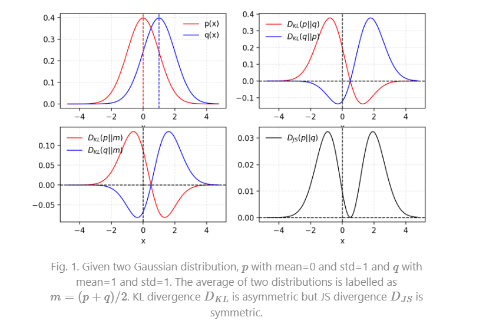

# KL JS  WASSERSTEIN

## 先验

### 信息量

​	任何事件都会承载着一定的信息量，包括已经发生的事件和未发生的事件，只是它们承载的信息量会有所不同。如**昨天下雨这个已知事件，因为已经发生，既定事实，那么它的信息量就为 0**。**如明天会下雨这个事件，因为未有发生，那么这个事件的信息量就大。 **

​	**事件发生的概率越小，其信息量越大。 **

计算信息量：

* *X*是一个离散型随机变量，其取值集合为$\chi$, 概率分布函数为$p(x)=\operatorname{Pr}(X=x), x \in \chi$ 则定义事件$X=x_0$ 的信息量为 $I\left(x_0\right)=-\log \left(p\left(x_0\right)\right)$.

### 熵:

当一个事件发生的概率为 $p(x)$ ,那么它的信息量是   $-\log (p(x))$.

我们**把这个事件的所有可能性罗列出来，就可以求得该事件信息量的期望 **信息量的期望就是熵，所以熵的公式为：

假设 事件 $X$ 共有 $\mathrm{n}$ 种可能，发生 $x_i$ 的概率为 $p\left(x_i\right)$ ，那么该事件的熵 $H(X)$ 为:
$$
H(X)=-\sum_{i=1}^n p\left(x_i\right) \log \left(p\left(x_i\right)\right)
$$

## KL

在机器学习中， $P$ 往往用来表示样本的**真实分布**， $Q$ 用来表示**模型所预测的分布**，那么 $K L$ 散度就 可以计算两个分布的差异，也就是 Loss 损失值。
$$
D_{K L}(p \| q)=\sum_{i=1}^n p\left(x_i\right) \log \left(\frac{p\left(x_i\right)}{q\left(x_i\right)}\right)   或
$$

$$
D_{K L}(p \| q)=\int_x p(x) \log \frac{p(x)}{q(x)} d x
$$

从 KL 散度公式中可以看到 Q 的分布越接近 P（**Q 分布越拟合 P**），那么散度值越小，即损失值越小。

KL散度满足:

- KL 散度不是对称的； $D (P||Q)!=D (Q||P)$
- KL 散度不满足三角不等式。
-  KL 散度的值为非负数。

## 交叉熵

  KL 散度公式进行变形：
$$
\begin{aligned}
& D_{K L}(p \| q)=\sum_{i=1}^n p\left(x_i\right) \log \left(\frac{p\left(x_i\right)}{q\left(x_i\right)}\right)=\sum_{i=1}^n p\left(x_i\right) \log \left(p\left(x_i\right)\right)- \\
& \sum_{i=1}^n p\left(x_i\right) \log \left(q\left(x_i\right)\right)=-H(p(x))+\left[-\sum_{i=1}^n p\left(x_i\right) \log \left(q\left(x_i\right)\right)\right]
\end{aligned}
$$
**等式的前一部分恰巧就是 p 的熵，等式的后一部分，就是交叉熵**。 **KL 散度 - 目标分布熵 = 交叉熵**。
$$
H(p, q)=-\sum_{i=1}^n p\left(x_i\right) \log \left(q\left(x_i\right)\right)
$$
首先损失函数的功能是通过样本来计算模型分布与目标分布间的差异，在分布差异计算中，**KL 散度是最合适的。**在实际中，某一事件的标签是已知不变的（例如我们设置猫的 label 为 1，那么所有关于猫的样本都要标记为 1），即目标分布的熵为**常数**。而根据下面 KL 公式可以看到，**KL 散度 - 目标分布熵 = 交叉熵（这里的 “-” 表示裁剪）**。所以我们不用计算 KL 散度，只需要计算交叉熵就可以得到模型分布与目标分布的损失值。 所以我们不用计算 KL 散度，只需要计算交叉熵就可以得到模型分布与目标分布的损失值。

## JS 散度

**JS 散度**度量了两个概率分布的相似度，基于 **KL 散度的变体**，解决了 **KL 散度非对称的问题**。一般地，**JS 散度是对称的**，其取值是 0 到 1 之间。定义如下：
$$
J S\left(P_1 \| P_2\right)=\frac{1}{2} K L\left(P_1 \| \frac{P_1+P_2}{2}\right)+\frac{1}{2} K L\left(P_2 \| \frac{P_1+P_2}{2}\right)
$$
 

## Wasserstein 距离

KL 散度和 JS 散度度量的问题：

如果两个分配 P,Q 离得很远，完全没有重叠的时候，那么 KL 散度值是没有意义的，而 JS 散度值是一个常数。这在学习算法中是比较致命的，这就意味这这一点的梯度为 0。梯度消失了。

**Wasserstein 距离**度量两个概率分布之间的距离，定义如下
$$
W\left(P_1, P_2\right)=\inf _{\gamma \sim \Pi\left(P_1, P_2\right)} \mathbb{E}_{(x, y) \sim \gamma}[\|x-y\|]
$$
$\Pi(P_1, P_2)$是 $P_1$ 和$P_2$ 分布组合起来的所有可能的联合分布的集合。对于每一个可能的联合分布$\gamma$,可以从中采样 $(x,y)∼γ$ 得到一个样本 x 和 y，并计算出这对样本的距离 $||x−y||$，所以可以计算该联合分布 $\gamma$下，样本对距离的期望值$E_{(x, y) \sim \gamma}[\|x-y\|]$。在所有可能的联合分布中能够对这个期望值取到的下界.

