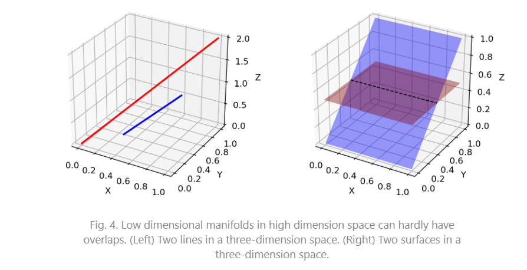
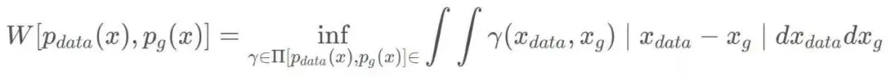
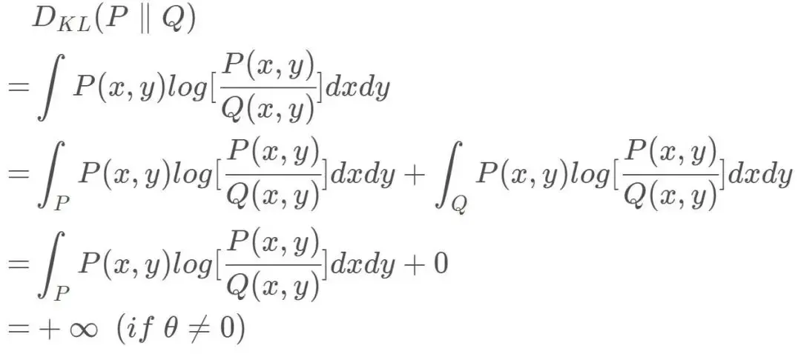

# WGAN

$$
\begin{aligned}
& \mathbb{E}_{x \sim P_g}[\log (1-D(x))]   \\
& \mathbb{E}_{x \sim P_g}[-\log D(x)]  
\end{aligned}
$$
原始 GAN 中判别器; 在 WGAN 两篇论文中称为 "the - log D alternative" 或 "the - log D trick"。WGAN 前作分别分析了这两种形式的原始 GAN 各自的问题所在 .

##   第一种原始 GAN 形式的问题

原始 GAN 中判别器要最小化如下损失函数，尽可能把真实样本分为正例，生成样本分为负例：
$$
-\mathbb{E}_{x \sim P_r}[\log D(x)]-\mathbb{E}_{x \sim P_g}[\log (1-D(x))]
$$
**一句话概括：判别器越好，生成器梯度消失越严重。**

在生成器 G 固定参数时最优的判别器 D 应该是什么，对于一个具体样本$x$ 它对公式 1 损失函数的贡献是
$$
-P_r(x) \log D(x)-P_g(x) \log [1-D(x)]
$$

$$
-\frac{P_r(x)}{D(x)}+\frac{P_g(x)}{1-D(x)}=0
$$

$$
D^*(x)=\frac{P_r(x)}{P_r(x)+P_g(x)}
$$

如果$P_r(x)=0$且 $P_g(x)\neq0$ 最优判别器就应该非常自信地给出概率 0；如果$P_r(x)=P_g(x)$

说明该样本是真是假的可能性刚好一半一半，此时最优判别器也应该给出概率 0.5。

**GAN 训练有一个 trick，就是别把判别器训练得太好，否则在实验中生成器会完全学不动（loss 降不下去），为了探究背后的原因，我们就可以看看在极端情况 —— 判别器最优时，生成器的损失函数变成什么。给公式 2 加上一个不依赖于生成器的项，使之变成**

$D^*(x)$ 带入  公式1 得到
$$
\mathbb{E}_{x \sim P_r} \log \frac{P_r(x)}{\frac{1}{2}\left[P_r(x)+P_g(x)\right]}+\mathbb{E}_{x \sim P_g} \log \frac{P_g(x)}{\frac{1}{2}\left[P_r(x)+P_g(x)\right]}-2 \log 2
$$

$$
\begin{aligned}
& K L\left(P_1 \| P_2\right)=\mathbb{E}_{x \sim P_1} \log \frac{P_1}{P_2} \\
& J S\left(P_1 \| P_2\right)=\frac{1}{2} K L\left(P_1 \| \frac{P_1+P_2}{2}\right)+\frac{1}{2} K L\left(P_2 \| \frac{P_1+P_2}{2}\right)  
\end{aligned}
$$

$$
2 J S\left(P_r \| P_g\right)-2 \log 2
$$

**key point**

在最优判别器下，我们可以把原始GAN定义的生成器loss等价变换为最小化真实分布$P_r$ 与生成分布$P_g$ 之间的JS散度。**我们越训练判别器，它就越接近最优**。 **最小化生成器的 loss 也就会越近似于最小化**$ P_r$ **和$P_g$ 之间的JS 散度。**

问题就出在这个 JS 散度上。我们会希望如果两个分布之间越接近它们的 JS 散度越小，我们通过优化 JS 散度就能将$P_g$ "拉向"$P_r$​, ，最终以假乱真。这个希望在两个分布有所重叠的时候是成立的，但是如果两个分布完全没有重叠的部分，或者它们重叠的部分可忽略（下面解释什么叫可忽略），它们的 JS 散度是多少呢？ 答案是log⁡2，因为对于任意一个 x 只有四种可能：
$$
\begin{aligned}
& P_1(x)=0 \text { 且 } P_2(x)=0 \\
& P_1(x) \neq 0 \text { 且 } P_2(x) \neq 0 \\
& P_1(x)=0 \text { 且 } P_2(x) \neq 0 \\
& P_1(x) \neq 0 \text { 且 } P_2(x)=0
\end{aligned}
$$

- 第一种对计算 JS 散度无贡献
-  第二种情况由于重叠部分可忽略所以贡献也为 0
- 第三种情况对公式 7 右边第一个项的贡献 $\log \frac{P_2}{\frac{1}{2}\left(P_2+0\right)}=\log 2$
- 第四种情况 $J S\left(P_1 \| P_2\right)=\log 2$

即无论$P_r$ 跟$P_g$ 是远在天边，还是近在眼前，只要它们俩没有一点重叠或者重叠部分可忽略，JS 散度就固定是常数log⁡2， **而这对于梯度下降方法意味着 —— 梯度为 0**.此时对于最优判别器来说，生成器肯定是得不到一丁点梯度信息的；即使对于接近最优的判别器来说，生成器也有很大机会面临梯度消失的问题。

> [Manifold ](https://en.wikipedia.org/wiki/Manifold) A topological space that locally resembles Euclidean space near each point when this Euclidean space is of **dimension** $n$ ,the manifold is referred as manifold.
>
> - 支撑集（support）其实就是函数的非零部分子集，比如 ReLU 函数的支撑集就是(0,+∞)，一个概率分布的支撑集就是所有概率密度非零部分的集合。
> - 流形（manifold）是高维空间中曲线、曲面概念的拓广，我们可以在低维上直观理解这个概念，比如我们说三维空间中的一个曲面是一个二维流形，因为它的本质维度（intrinsic dimension）只有 2，一个点在这个二维流形上移动只有两个方向的自由度。同理，三维空间或者二维空间中的一条曲线都是一个一维流形。

$Pr$  已发现它们集中在较低维流形中。这实际上是流形学习的基本假设。想想现实世界的图像，一旦主题或所包含的对象固定，图像就有很多限制可以遵循，例如狗应该有两只耳朵和一条尾巴，摩天大楼应该有笔直而高大的身体，等等。这些限制使图像无法具有高维自由形式。

$P_g$ 也存在于低维流形中。每当生成器被要求提供更大的图像（例如 64x64），给定小尺寸（例如 100），噪声变量输入$z$ 这4096个像素的颜色分布是由100维的小随机数向量定义的，很难填满整个高维空间。

$P_r$ 和 $P_g$ 不重叠或重叠部分可忽略的可能性有多大？不严谨的答案是：非常大。

both $P_r$ and $p_g$ 处于低维流形中，他们几乎不会相交。（wgan 前面一篇理论证明）

 GAN 中的生成器一般是从某个低维（比如 100 维）的随机分布中采样出一个编码向量 $z$，再经过一个神经网络生成出一个高维样本（比如 64x64 的图片就有 4096 维）。当生成器的参数固定时，生成样本的概率分布虽然是定义在 4096 维的空间上，但它本身所有可能产生的变化已经被那个 100 维的随机分布限定了，其本质维度就是 100，再考虑到神经网络带来的映射降维，最终可能比 100 还小，所以生成样本分布的支撑集就在 4096 维空间中构成一个最多 100 维的低维流形，“撑不满” 整个高维空间。

我们就得到了 WGAN 前作中关于生成器梯度消失的第一个论证：**在（近似）最优判别器下，最小化生成器的 loss 等价于最小化** $P_r$ 与$P_g$ 之间的JS散度，而由于$P_r$ 与$P_g$ **几乎不可能有不可忽略的重叠，所以无论它们相距多远 JS 散度都是常数log⁡2，最终导致生成器的梯度（近似）为 0，梯度消失。**

**原始 GAN 不稳定的原因就彻底清楚了：判别器训练得太好，生成器梯度消失，生成器 loss 降不下去；判别器训练得不好，生成器梯度不准，四处乱跑。只有判别器训练得不好不坏才行，但是这个火候又很难把握，甚至在同一轮训练的前后不同阶段这个火候都可能不一样，所以 GAN 才那么难训练。**

## 第二种原始 GAN 形式的问题 “the - log D trick”

一句话概括：最小化第二种生成器 loss 函数，会等价于最小化一个不合理的距离衡量，导致两个问题，一是梯度不稳定，二是 **Mode collapse 即多样性不足。**WGAN 前作又是从两个角度进行了论证

上文推导已经得到在最优判别器$D^*$ 下
$$
\mathbb{E}_{x \sim P_r}\left[\log D^*(x)\right]+\mathbb{E}_{x \sim P_g}\left[\log \left(1-D^*(x)\right)\right]=2 J S\left(P_r \| P_g\right)-2 \log 2
$$

$$
\begin{aligned}
K L\left(P_g \| P_r\right) & =\mathbb{E}_{x \sim P_g}\left[\log \frac{P_g(x)}{P_r(x)}\right] \\
& =\mathbb{E}_{x \sim P_g}\left[\log \frac{P_g(x) /\left(P_r(x)+P_g(x)\right)}{P_r(x) /\left(P_r(x)+P_g(x)\right)}\right] \\
& =\mathbb{E}_{x \sim P_g}\left[\log \frac{1-D^*(x)}{D^*(x)}\right] \\
& =\mathbb{E}_{x \sim P_g} \log \left[1-D^*(x)\right]-\mathbb{E}_{x \sim P_g} \log D^*(x)
\end{aligned}
$$

$$
\begin{aligned}
\mathbb{E}_{x \sim P_g}\left[-\log D^*(x)\right] & =K L\left(P_g \| P_r\right)-\mathbb{E}_{x \sim P_g} \log \left[1-D^*(x)\right] \\
& =K L\left(P_g \| P_r\right)-2 J S\left(P_r \| P_g\right)+2 \log 2+\mathbb{E}_{x \sim P_r}\left[\log D^*(x)\right]
\end{aligned}
$$

注意上式最后两项不依赖于生成器 $G$ ，最终得到最小化公式 3 等价于最小化 $K L\left(P_g \| P_r\right)-2 J S\left(P_r \| P_g\right)$  

这个等价最小化目标存在两个严重的问题。第一是它同时要**最小化生成分布与真实分布的 KL 散度**，却又要**最大化两者的 JS 散度，一个要拉近，一个却要推远**！这在直观上非常荒谬，**在数值上则会导致梯度不稳定，这是后面那个 JS 散度项的毛病。**

第二，即便是前面那个正常的 KL 散度项也有毛病。因为 KL 散度不是一个对称的衡量 $K L\left(P_g \| P_r\right)$ 与 $K L\left(P_r \| P_g\right)$ 是有差别的。 

 

## Wasserstein 距离的优越性质

$$
W\left(P_r, P_g\right)=\inf _{\gamma \sim \Pi\left(P_r, P_g\right)} \mathbb{E}_{(x, y) \sim \gamma}[\|x-y\|]
$$

可以看出 Wasserstein 距离处处连续，而且几乎处处可导，数学性质非常好，能够在两个分布没有重叠部分的时候，依旧给出合理的距离度量。对于离散概率分布，Wasserstein 距离也被描述性地称为推土机距离 (EMD)。 如果我们将分布想象为一定量地球的不同堆，那么 EMD 就是将一个堆转换为另一堆所需的最小总工作量。

解释如下: $\Pi\left(P_r, P_g\right)$ 是 $P_r$ 和 $P_g$ 组合起来的所有可能**的联合分布的集合**，反过来说， $\Pi\left(P_r, P_g\right)$ 中每一个分布的边缘分布都是 $P_r$ 和 $P_g$ 。对于每一个可能的联合分布 $\gamma$ 而言，可以从 中采样 $(x, y) \sim \gamma$ 得到一个真实样本 $x$ 和一个生成样本 $y$ ，并算出这对样本的距离 $\|x-y\|$ ，所 以可以计算该联合分布 $\gamma$ 下样本对距离的期望值 $\mathbb{E}_{(x, y) \sim \gamma}[\|x-y\|]$ 。在所有可能的联合分布中 够对这个期望值取到的下界inf $\operatorname{in}_{\gamma \sim\left(P_r, P_g\right)} \mathbb{E}_{(x, y) \sim \gamma}[\|x-y\|]$ ，就定义为 Wasserstein 距离。

直观上可以把 $\mathbb{E}_{(x, y) \sim \gamma}[\|x-y\|]$ 理解为在 $\gamma$ 这个 “路径规划" 下把 $P_r$ 这堆 “沙土" 挪到 $P_g$ “位置” 所需的 “消耗”, 而 $W\left(P_r, P_g\right)$ **就是 “最优路径规划" 下的 “最小消耗”，所以才 叫 Earth-Mover (推土机 ) 距离**。

Wasserstein 距离相比 KL 散度、JS 散度的优越性在于，即便两个分布没有重叠，Wasserstein 距离仍然能够反映它们的远近。WGAN 本作通过简单的例子展示了这一点。考虑如下二维空间中 的两个分布 $P_1$ 和 $P_2 ， P_1$ 在线段 $\mathrm{AB}$ 上均匀分布， $P_2$ 在线段 $\mathrm{CD}$ 上均匀分布，通过控制参数 $\theta$ 可以控制着两个分布的距离远近。

$$
\begin{aligned}
& K L\left(P_1 \| P_2\right)=K L\left(P_1|| P_2\right)=\left\{\begin{array}{ll}
+\infty & \text { if } \theta \neq 0 \\
0 & \text { if } \theta=0
\end{array}\right. \text { (突变) } \\
& J S\left(P_1 \| P_2\right)=\left\{\begin{array}{ll}
\log 2 & \text { if } \theta \neq 0 \\
0 & \text { if } \theta-0
\end{array}\right. \text { (突变 ) } \\
& W\left(P_0, P_1\right)=|\theta| \text { (平滑 ) }
\end{aligned}
$$

## 第四部分：从 Wasserstein 距离到 WGAN

$$
\operatorname{EMD}\left(P_r, P_\theta\right)=\inf _{\gamma \in \Pi} \sum_{x, y}\|x-y\| \gamma(x, y)=\inf _{\gamma \in \Pi} \mathbb{E}_{(x, y) \sim \gamma}\|x-y\|
$$

It is intractable to exhaust all the possible joint distributions in $\Pi\left(p_r, p_g\right)$ to compute $\inf _{\gamma \sim \Pi\left(p_r, p_g\right)}$ Thus the authors proposed a smart transformation of the formula based on the KantorovichRubinstein duality to: 作者提出了基于 Kantorovich-Rubinstein 对偶性的公式的巧妙转换：
$$
W\left(p_r, p_g\right)=\frac{1}{K} \sup _{\|f\| L \leq K} \mathbb{E}_{x \sim p_r}[f(x)]-\mathbb{E}_{x \sim p_g}[f(x)]
$$
首先需要介绍一个概念——Lipschitz 连续。它其实就是在一个连续函数 $f$ 上面额外施加了一个限 制，要求存在一个常数 $K \geq 0$ 使得定义域内的任意两个元素 $x_1$ 和 $x_2$ 都满足
$$
\left|f\left(x_1\right)-f\left(x_2\right)\right| \leq K\left|x_1-x_2\right|
$$
此时称函数 $f$ 的 Lipschitz 常数为 $K$ 。

上**述公式 的意思就是在要求函数 $f$ 的 Lipschitz 常数 $\mid f \|_L$ 不超过 $K$ 的条件下，对所有可能满足 件的 $f$ 取到趻 数 $w$ 来定义一系列可能的函数 $f_w$ ，此时求解**公式 **可以近似变成求解如下形式**
$$
K \cdot W\left(P_r, P_g\right) \approx \max _{w:\left|f_w\right|_L \leq K} \mathbb{E}_{x \sim P_r}\left[f_w(x)\right]-\mathbb{E}_{x \sim P_g}\left[f_w(x)\right] 
$$

$$
W\left(p_r, p_\theta\right)=\inf _{\gamma \in \pi} \iint\|x-y\| \gamma(x, y) \mathrm{d} x \mathrm{~d} y=\inf _{\gamma \in \pi} \mathbb{E}_{x, y \sim \gamma}[\|x-y\|] .
$$

$$
\begin{aligned}
W\left(p_r, p_\theta\right) & =\inf _{\gamma \in \pi} \mathbb{E}_{x, y \sim \gamma}[\|x-y\|] \\
& =\inf _\gamma \mathbb{E}_{x, y \sim \gamma}[\|x-y\|+\underbrace{\left.\sup _f \mathbb{E}_{s \sim p_r}[f(s)]-\mathbb{E}_{t \sim p_\theta}[f(t)]-(f(x)-f(y))\right]} \\
& =\left\{\begin{array}{c}
0, \text { if } \gamma \in \pi \\
+\infty \text { else }
\end{array}\right. \\
& =\inf _\gamma \sup _f \mathbb{E}_{x, y \sim \gamma}\left[\|x-y\|+\mathbb{E}_{s \sim p_r}[f(s)]-\mathbb{E}_{t \sim p_\theta}[f(t)]-(f(x)-f(y))\right]
\end{aligned}
$$

$$
\begin{array}{r}
\sup _f \inf _\gamma \mathbb{E}_{x, y \sim \gamma}\left[\|x-y\|+\mathbb{E}_{s \sim p_r}[f(s)]-\mathbb{E}_{t \sim p_\theta}[f(t)]-(f(x)-f(y))\right] \\
=\sup _f \mathbb{E}_{s \sim p_r}[f(s)]-\mathbb{E}_{t \sim p_\theta}[f(t)]+\underbrace{\inf _\gamma \mathbb{E}_{x, y \sim \gamma}[\|x-y\|-(f(x)-f(y))]}_\gamma \\
=\left\{\begin{array}{cc}
0, & \text { if }\|f\|_L \leq 1 \\
-\infty & \text { else }
\end{array}\right.
\end{array}
$$

$$
\begin{aligned}
W\left(p_r, p_\theta\right) & =\sup _f \mathbb{E}_{s \sim p_r}[f(s)]-\mathbb{E}_{t \sim p_\theta}[f(t)]+\inf _\gamma \mathbb{E}_{x, y \sim \gamma}[\|x-y\|-(f(x)-f(y))] \\
& =\sup _{\|f\|_{L \leq 1}} \mathbb{E}_{s \sim p_r}[f(s)]-\mathbb{E}_{t \sim p_\theta}[f(t)]
\end{aligned}
$$